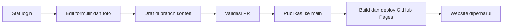

# Rencana implementasi CMS WalianHub

Tanggal: 5 Oktober 2026. Penanggung jawab implementasi: pembuat CMS (teman pemilik proyek).

Dokumen ini menjadi panduan untuk mengambil kode dari GitHub, membuat CMS, dan mengirim perubahan melalui pull request. CMS belum diimplementasikan. Rencana memakai file konten yang sudah dibaca frontend; produk CMS dan layanan login belum dipilih.

## 1. Hasil yang harus dicapai

Staf kelurahan dapat login, mengubah informasi website, mengunggah foto, menyimpan draf, dan menerbitkan perubahan tanpa menulis kode. Perubahan yang terbit masuk ke branch `main`, lalu website diperbarui melalui build dan deploy. Data contoh tetap boleh dipakai selama demo; koreksi data resmi dilakukan bersama kelurahan melalui CMS.

Modul tahap pertama:

| Menu CMS | Kemampuan |
|---|---|
| Pengaturan situs | Identitas kelurahan, alamat, kontak, lokasi, jadwal kantor, tanggal libur, media sosial, tautan penting, kredit |
| Beranda | Judul, subjudul, dan maksimal 5 foto hero beserta keterangan dan posisi |
| Profil | Ringkasan, Lurah, bagan organisasi, data lingkungan, sumber data, visi, misi, program unggulan |
| Layanan | Tambah, edit, hapus layanan; syarat, alur, catatan, urutan, dan pilihan Beranda |
| Pengumuman | Tambah, edit, hapus pengumuman pada halaman Layanan; tanggal dan label Penting |
| Destinasi wisata | Tambah, edit, hapus destinasi; foto, kategori, titik Maps, urutan, dan pilihan Beranda |
| Media | Unggah dan pilih foto; cegah penghapusan media yang masih dipakai |

Website tetap merupakan situs informasi publik. Pengajuan surat online, akun warga, penyimpanan data pribadi warga, berita, Bahasa Inggris, modul Potensi terpisah, dan halaman detail destinasi berada di luar tahap ini. Tata letak, teks tombol, navigasi otomatis, dan pengaturan indeks mesin pencari dikelola frontend.

## 2. Kondisi repository dan sumber acuan

| Bagian | Kondisi saat rencana dibuat |
|---|---|
| Repository | `GibranAlkatiri/WalianHub`, branch utama `main` |
| Frontend | Astro, Tailwind CSS, Bun; hasil build statis di `dist/` |
| Pratinjau publik | `https://gibranalkatiri.github.io/WalianHub/` |
| Base path | `/WalianHub`, diatur dalam [astro.config.mjs](astro.config.mjs) |
| Kontrak konten | [src/content.config.ts](src/content.config.ts) |
| Validasi tambahan | [validasi-konten.ts](src/lib/validasi-konten.ts) dan [bagan.ts](src/lib/bagan.ts) |
| Publikasi saat ini | [.github/workflows/deploy.yml](.github/workflows/deploy.yml): `push` ke `main` atau dijalankan manual |
| Pemeriksaan saat ini | `bun test`, kemudian `bun run build`; belum ada workflow pemeriksaan `pull_request` |
| Status demo | [SIAP_DIINDEKS](src/lib/konfigurasi.ts) masih `false` |

Jika ringkasan field dalam dokumen ini berbeda dengan kode pada branch terbaru, periksa schema dan komponen pembacanya sebelum mengubah integrasi. Perubahan kontrak harus dijelaskan dalam PR beserta migrasi konten dan penyesuaian frontend.

Panduan ini sengaja berada di akar repository. Folder `docs/` pada checkout penulis dikecualikan oleh konfigurasi Git lokal; implementasi dan panduan operasional yang ingin dibagikan harus berada di lokasi yang dilacak Git.

## 3. Arsitektur yang diusulkan

Gunakan CMS berbasis Git sebagai jalur awal karena konten sudah berbentuk JSON dan Markdown. Ini rekomendasi arsitektur untuk proyek ini, bukan keputusan produk final. Uji Decap CMS sebagai kandidat pertama; pembuat CMS dapat memilih produk lain setelah membuktikan dukungan kontrak, login, dan publikasi.

Alur target:



Pisahkan draf dari publikasi. Pada Decap, mode editorial menyimpan perubahan dalam branch/PR dan menerbitkannya melalui merge; dukungannya dijelaskan dalam [dokumentasi editorial workflow](https://decapcms.org/docs/editorial-workflows/). Pilihan ini tetap harus diuji dengan aturan branch repository dan akun staf yang sebenarnya.

Untuk kandidat Decap, lokasi yang diusulkan adalah `public/admin/index.html` dan `public/admin/config.yml`. Panel akan diakses melalui `/WalianHub/admin/`. Konfigurasi dan aset panel harus mengikuti base path; hindari referensi `/admin/...` yang mengarah ke akar domain akun. Konfigurasi Decap mendukung file collections, folder collections, serta pemisahan folder media dan path publik; lihat [opsi konfigurasi resmi](https://decapcms.org/docs/configuration-options/).

GitHub Pages saat ini hanya menyajikan hasil statis. Jika memakai backend GitHub Decap, login memerlukan layanan autentikasi terpisah atau penyedia autentikasi hosted. Backend langsung ini menggunakan akun GitHub dengan akses push ke repository, sesuai [dokumentasi backend GitHub](https://decapcms.org/docs/github-backend/). Memasang halaman admin saja belum menyelesaikan login atau hak akses.

Jika staf tidak akan memakai akun GitHub, atau harus dibatasi agar hanya dapat mengubah konten, pilih layanan/backend yang benar-benar menyediakan batas tersebut. Menyembunyikan menu kode di panel tidak membatasi izin GitHub pemilik akun.

CMS dengan database/API tetap mungkin, tetapi memerlukan rancangan tambahan: hosting backend, loader Astro, pemetaan data, pengambilan konten saat build, media, pemicu deploy, backup, dan pemulihan. Ajukan rancangan perubahan tersebut sebelum implementasi; kontrak tampilan dan identitas layanan tetap harus dipertahankan.

## 4. Keputusan awal dan uji kelayakan

Kerjakan PR pertama sebagai uji kelayakan, sebelum membuat seluruh formulir. Pemilik repository membantu menyiapkan akses dan akun; pembuat CMS mendokumentasikan kebutuhan yang konkret.

| Keputusan | Arahan awal | Hasil yang harus dicatat di PR pertama |
|---|---|---|
| Produk CMS | Berbasis Git; Decap kandidat pertama | Produk, versi yang dikunci, alasan, dan hasil uji |
| Login | Akun per pengelola | Cara login, pemilik layanan, callback, cara menambah/mencabut akses |
| Hak publikasi | Draf diperiksa sebelum masuk `main` | Siapa boleh menyimpan, siapa boleh menerbitkan, batas yang benar-benar ditegakkan backend |
| Hosting panel/auth | Website tetap di Pages untuk tahap awal | Alamat panel, alamat layanan auth, kebutuhan environment variable |
| Biaya dan pemeliharaan | Hindari ketergantungan yang tidak ada pengelolanya | Biaya layanan jika ada dan pengelola setelah KKT |
| Pemeriksaan PR | Validasi otomatis sebelum merge | Nama check, aturan branch, dan bukti publish tunduk pada check |
| Pratinjau draf | Mulai dari build lokal | Apakah preview deployment diperlukan dan bagaimana disediakan |

Uji dengan branch/salinan repository untuk percobaan konten. Panel yang dijalankan lokal bisa tetap menulis ke repository remote jika backend-nya mengarah ke sana; periksa konfigurasi sebelum mencoba simpan, sesuai [catatan konfigurasi backend Decap](https://decapcms.org/docs/configuration-options/).

Uji minimal: edit satu layanan dan catatannya, edit satu angka lingkungan menjadi `null`, simpan satu hari tutup, unggah satu foto, login/logout, simpan draf, dan terbitkan perubahan pada lingkungan uji. Buka kembali setiap formulir setelah disimpan. Jika widget bawaan tidak dapat menyimpan `null` atau objek bersarang dengan benar, buat adaptor/widget yang diperlukan atau pilih produk lain; jangan melemahkan schema agar cocok dengan widget.

## 5. Kontrak penyimpanan

| Koleksi | Lokasi | Bentuk penyimpanan |
|---|---|---|
| `situs` | [situs.json](src/content/pengaturan/situs.json) | Satu objek JSON; file tetap |
| `beranda` | [beranda.json](src/content/pengaturan/beranda.json) | Satu objek JSON; file tetap |
| `profil` | [profil.json](src/content/pengaturan/profil.json) | Satu objek JSON; file tetap |
| `pengumuman` | [pengumuman.json](src/content/pengaturan/pengumuman.json) | Satu objek JSON dengan daftar pengumuman; file tetap |
| `layanan` | `src/content/layanan/*.md` | Satu file per layanan, YAML frontmatter dan body Markdown |
| `destinasi` | `src/content/destinasi/*.md` | Satu file per destinasi, YAML frontmatter; body belum ditampilkan |

Keempat file pengaturan wajib dipertahankan. Jangan menyediakan tombol hapus file pengaturan; pengumuman dihapus dari `daftar`, bukan dengan menghapus `pengumuman.json`.

Aturan serialisasi:

- Nama field mengikuti schema; label formulir boleh berbahasa Indonesia.
- Angka ditulis sebagai angka JSON/YAML, boolean sebagai `true`/`false`, dan daftar sebagai array. Daftar kosong adalah `[]`.
- `null`, string kosong `""`, dan field yang tidak dicantumkan memiliki arti berbeda. Angka lingkungan yang belum diketahui harus tetap `null`, bukan `0`, `""`, atau field yang hilang.
- Tanggal disimpan sebagai `YYYY-MM-DD`, tanpa jam/zona waktu. Jam disimpan sebagai string `"08.00"`; jangan mengubahnya menjadi angka atau `08:00`.
- Field yang tidak diubah tetap dipertahankan, termasuk body layanan. Pastikan membuka lalu menyimpan formulir tidak membuang data yang sudah ada.
- Tidak ada field `draft` atau `published` dalam schema saat ini. Draf dipisahkan melalui branch CMS; menambahkan flag ke file saja tidak membuat frontend menyembunyikan konten.
- Identitas layanan dan destinasi mengikuti nama file. Tetapkan slug unik saat membuat item (huruf kecil dan tanda hubung); kunci identitas setelah dibuat. Mengubah `judul`/`nama` tidak mengganti file.

Contoh: mengganti judul dalam `surat-keterangan-domisili.md` tetap mempertahankan tautan `/WalianHub/layanan#surat-keterangan-domisili`. Penghapusan layanan berarti tautan tersebut tidak lagi menemukan item; panel perlu meminta konfirmasi penghapusan. Perubahan nama file merupakan migrasi tersendiri.

### 5.1 Pengaturan situs

| Field | Isian dan aturan |
|---|---|
| `namaKelurahan`, `kecamatan`, `kota`, `provinsi`, `alamat`, `kredit` | Teks wajib, tidak hanya spasi |
| `koordinat.lat`, `koordinat.lng` | Angka wajib; latitude −90–90, longitude −180–180 |
| `googleMapsUrl` | URL HTTP/HTTPS lengkap; boleh `""` atau tidak dicantumkan |
| `whatsapp` | String 8–15 digit, kode negara tanpa `+`/spasi; contoh `6281234567890`; boleh `""` atau tidak dicantumkan |
| `email` | Email valid; boleh `""` atau tidak dicantumkan |
| `jamLayanan.jadwal` | Tepat 7 entri, masing-masing hari muncul satu kali |
| `jamLayanan.jadwal[].hari` | `Senin`, `Selasa`, `Rabu`, `Kamis`, `Jumat`, `Sabtu`, `Minggu` |
| `jamLayanan.jadwal[].buka`, `.tutup` | String `HH.MM` atau `null`; wajib disimpan keduanya |
| `jamLayanan.jadwal[].istirahat` | `null` atau objek `{ mulai, selesai }` dengan jam `HH.MM` |
| `jamLayanan.tanggalLibur[]` | `{ tanggal, keterangan }`; tanggal kalender valid dan keterangan wajib |
| `mediaSosial[]` | `{ platform, url }`; platform: `facebook`, `instagram`, `youtube`, `tiktok`; URL wajib |
| `tautanPenting[]` | `{ label, url }`; label dan URL wajib |

Form jadwal sebaiknya menyediakan 7 baris tetap dan pilihan Buka/Tutup per hari. Hari tutup menyimpan `buka: null`, `tutup: null`, `istirahat: null`. Hari buka wajib memiliki jam tutup setelah jam buka; istirahat harus berurutan dan berada di dalam jam layanan. Pilihan Buka/Tutup merupakan kontrol formulir, bukan field baru di file. Status kantor dihitung frontend dalam WITA.

Nomor kontak digunakan bersama oleh halaman Layanan dan bagian Hubungi Kami. Footer menampilkan nomor saja; tombol Chat WhatsApp di footer sudah dihapus. CMS cukup mengubah nomor pada `situs.json`.

### 5.2 Beranda

| Field | Isian dan aturan |
|---|---|
| `hero.judul`, `hero.subjudul` | Teks wajib |
| `hero.foto` | Daftar maksimal 5 foto; `[]` diperbolehkan |
| `hero.foto[].gambar` | String path gambar; boleh `""` |
| `hero.foto[].keterangan` | Teks wajib untuk alternatif foto; tetap perlu diisi meskipun tidak tampil sebagai caption |
| `hero.foto[].posisi` | `kiri`, `tengah`, `kanan`; default `tengah` |

Urutan foto mengikuti urutan daftar. Slideshow dan tombol jeda sudah ditangani frontend.

### 5.3 Profil

| Field | Isian dan aturan |
|---|---|
| `ringkasan` | Teks wajib |
| `lurah.nama` | Teks wajib; digunakan bersama oleh kepala halaman dan puncak bagan |
| `lurah.foto` | String path gambar; boleh kosong atau tidak dicantumkan |
| `strukturOrganisasi[]` | `{ jabatan, nama, atasan, garisSamping }` |
| `strukturOrganisasi[].jabatan` | Teks wajib, unik; tidak boleh membuat entri `Lurah` kedua |
| `strukturOrganisasi[].nama` | Daftar string; `[]` berarti jabatan belum terisi |
| `strukturOrganisasi[].atasan` | `Lurah` atau jabatan lain yang ada dalam daftar |
| `strukturOrganisasi[].garisSamping` | Boolean, default `false` |
| `sumberData.tahun`, `sumberData.sumber` | Teks wajib; tahun berupa teks, bukan angka |
| `lingkungan[]` | `{ nama, kepala, wakil, kepalaKeluarga, jumlahPenduduk, luasKm2 }` |
| `lingkungan[].nama` | Teks wajib |
| `lingkungan[].kepala`, `.wakil` | String wajib ada, tetapi boleh `""` |
| `lingkungan[].kepalaKeluarga`, `.jumlahPenduduk` | Bilangan bulat nonnegatif atau `null` |
| `lingkungan[].luasKm2` | Angka nonnegatif atau `null`; desimal diperbolehkan |
| `visi` | Teks wajib |
| `misi`, `programUnggulan` | Daftar teks tidak kosong per item; daftar boleh `[]` |
| `sumberVisiMisi` | URL HTTP/HTTPS; boleh `""` atau tidak dicantumkan |
| `diperbarui` | Tanggal kalender valid `YYYY-MM-DD` |

Bagan wajib tersambung sampai `Lurah`, tanpa siklus. Entri `garisSamping: true` tidak boleh memiliki bawahan. Saat jabatan diganti/dihapus, periksa seluruh referensi `atasan`; jangan meninggalkan referensi yang putus. Gunakan pilihan atasan dari daftar yang ada dan pemeriksaan [cekBagan](src/lib/bagan.ts). Urutan kotak mengikuti urutan daftar.

Total KK, penduduk, dan luas dihitung frontend dari angka lingkungan yang terisi. Jangan menambah field total yang harus diperbarui staf secara manual. Bedakan nilai nol yang diketahui dari data yang belum tersedia (`null`).

### 5.4 Layanan

| Field | Isian dan aturan |
|---|---|
| `judul` | Teks wajib |
| `ringkasan` | Teks wajib, maksimal 120 karakter |
| `ikon` | Pilihan nama file yang tersedia di `src/icons/`, tanpa `.svg`; default `file-text` |
| `unggulan` | Boolean, default `false` |
| `urutan` | Angka, default `100`; lebih kecil tampil lebih awal |
| `persyaratan`, `alur` | Daftar teks wajib per item; `[]` diperbolehkan |
| `diperbarui` | Tanggal kalender valid `YYYY-MM-DD` |
| Body Markdown | Catatan tambahan opsional, ditulis sesudah penutup frontmatter; bukan field frontmatter `catatan` |

Beranda menampilkan maksimal 4 layanan yang ditandai `unggulan`, menurut `urutan`. Ini batas tampilan, bukan batas jumlah `unggulan` yang divalidasi schema. Jika lebih dari 4 dipilih, panel dapat memberi pemberitahuan tentang batas tampilan. Jika tidak ada unggulan, Beranda tidak otomatis memilih layanan lain.

Daftar layanan menampilkan semua item menurut `urutan` lalu `judul`. Syarat/alur kosong menampilkan pesan informasi sedang disiapkan. Field `biaya` dan `lamaProses` tidak ada pada kontrak sekarang.

### 5.5 Pengumuman

| Field | Isian dan aturan |
|---|---|
| `daftar` | Daftar pengumuman; boleh `[]` |
| `daftar[].judul` | Teks wajib |
| `daftar[].tanggal` | Tanggal kalender valid `YYYY-MM-DD` |
| `daftar[].isi` | Teks wajib, multiline; teks biasa, bukan Markdown |
| `daftar[].penting` | Boolean, default `false` |

Pengumuman tampil hanya di halaman Layanan, terbaru di atas. Jika daftar kosong, section disembunyikan. Belum ada jadwal terbit otomatis atau tanggal kedaluwarsa; tanggal masa depan tidak menjadikan item sebagai draf. Untuk menarik pengumuman, hapus entri lalu terbitkan perubahan.

### 5.6 Destinasi wisata

| Field | Isian dan aturan |
|---|---|
| `nama` | Teks wajib |
| `kategori` | `Alam`, `Budaya`, `Kuliner`, `Religi`, `Olahraga`, `Lainnya` |
| `ringkasan` | Teks wajib, maksimal 160 karakter |
| `gambar` | String path gambar; boleh kosong atau tidak dicantumkan |
| `lokasi.alamat` | Teks wajib |
| `lokasi.lat`, `lokasi.lng` | Angka wajib; latitude −90–90, longitude −180–180 |
| `unggulan` | Boolean, default `false` |
| `urutan` | Angka, default `100` |
| `diperbarui` | Tanggal kalender valid `YYYY-MM-DD` |

Tombol Cek Lokasi memakai koordinat, bukan pencarian berdasarkan nama. CMS perlu membantu staf memeriksa titik yang dipilih; jangan diam-diam mengisi koordinat kantor untuk destinasi baru.

Aturan Wisata sudah dihitung oleh [src/lib/wisata.ts](src/lib/wisata.ts) saat build:

- Sampai 4 destinasi: semua tampil di Beranda, menu menuju `/#wisata`.
- Mulai 5: menu menuju `/wisata`; Beranda menampilkan 4 pilihan, mengutamakan `unggulan`, kemudian melengkapi menurut urutan.
- Daftar `/wisata` selalu tersedia, bahkan ketika jumlah turun atau kosong. Urutan daftar: `urutan`, nama, lalu identitas file.

CMS tidak memerlukan saklar untuk mengubah tujuan menu atau jumlah kartu. Body Markdown destinasi belum ditampilkan; jangan menawarkan editor deskripsi panjang pada tahap ini.

## 6. Media dan pratinjau

Simpan unggahan baru di `public/uploads/` dan nilai kontennya sebagai `/uploads/nama-file.webp`. Contoh pemetaan:

| Kegunaan | Path |
|---|---|
| File di repository | `public/uploads/foto-wisata.webp` |
| Nilai field `gambar` | `/uploads/foto-wisata.webp` |
| URL pada Pages | `/WalianHub/uploads/foto-wisata.webp` |

Frontend menambahkan base path melalui [url.ts](src/lib/url.ts). Jangan menyimpan `/WalianHub` dalam field gambar, karena akan ditambahkan dua kali. Media lama di `public/images/` tetap harus dapat dipilih/dipertahankan. Preview panel perlu menyelesaikan path media sesuai lokasi panel dan sumber draf; jangan mengubah nilai file konten untuk memperbaiki preview.

Persyaratan implementasi media:

- Terima foto JPEG, PNG, dan WebP. Usulan batas awal unggahan 5 MB per file; tampilkan pesan jika terlalu besar. Batas ini tambahan CMS, belum divalidasi schema frontend.
- Gunakan nama file unik agar unggahan baru tidak menimpa foto lain. Optimalkan foto sebelum publikasi jika memungkinkan; dokumentasikan ukuran hasil dan jangan menambah layanan media tanpa pengelola.
- Minta keterangan foto hero, dan pertahankan alternatif gambar yang sudah dihasilkan frontend untuk Lurah/destinasi.
- Cegah penghapusan media yang masih direferensikan, termasuk dalam draf yang dikelola CMS. Jika backend tidak menyediakan pemeriksaan referensi, nonaktifkan hapus media bagi staf pada tahap pertama; pemeliharaan media dilakukan maintainer.
- Gambar kosong atau gagal dimuat harus tetap menggunakan `public/images/default.svg` dengan label Foto belum tersedia. Fallback bukan pengganti pemeriksaan keberhasilan unggahan.

Preview konten bawaan panel dan preview website hasil Astro merupakan dua hal berbeda. Tahap awal cukup menyediakan preview field dan hasil build lokal untuk review developer. Jika dibutuhkan URL preview draf untuk staf, implementasikan deployment preview terpisah; workflow Pages saat ini belum membuatnya.

## 7. Login dan alur publikasi

Gunakan akun individu, login/logout yang dapat diuji, serta prosedur pencabutan akses. Secret OAuth dan token layanan disimpan pada environment layanan terkait, tidak di file admin publik atau repository. Catat nama environment variable dan lokasinya dalam panduan setup tanpa nilai rahasia.

Target operasional awal adalah satu staf pengelola konten dan satu penanggung jawab teknis. Pembagian editor/penerbit boleh dilakukan oleh orang yang sama jika disepakati; kemampuan tersebut harus sesuai izin backend. Akun tanpa izin tidak boleh menulis atau menerbitkan walaupun halaman panel dapat dibuka.

Alur publikasi yang harus dibuktikan:

1. Simpan draf ke branch konten dan PR. Konten publik belum berubah.
2. CI PR menjalankan instalasi sesuai lockfile, `bun test`, dan `bun run build`.
3. Jika check gagal, tampilkan/berikan tautan ke penyebab dan perbaiki draf. PR tidak dapat diterbitkan sebelum check wajib berhasil.
4. Penerbit melakukan publikasi/merge ke `main`; perubahan memicu workflow Pages.
5. Nyatakan Terbit setelah deployment commit tersebut berhasil. Jika panel tidak menyediakan status deploy, sediakan tautan Actions dan jelaskan bahwa simpan/merge belum berarti website sudah diperbarui.
6. Jika deploy gagal, website sebelumnya tetap tersedia. Perbaiki commit lalu deploy ulang; jangan menandai gagal sebagai berhasil.

Tambahkan workflow CI PR tersendiri, misalnya `.github/workflows/ci.yml`, dengan izin baca dan tanpa job deploy. Workflow deploy yang ada tetap menerbitkan `main`. Maintainer kemudian mengatur check tersebut sebagai syarat merge; file workflow saja tidak mengaktifkan perlindungan branch. Uji apakah tombol publish CMS mematuhi syarat itu dan apakah akun publikasi memiliki izin yang tepat.

Uji pemicu Actions dengan kredensial yang benar-benar dipakai CMS. Jangan menganggap semua penulisan bot menghasilkan event deploy: event yang dibuat menggunakan `GITHUB_TOKEN` memiliki pembatasan, dengan pengecualian untuk dispatch, sebagaimana dijelaskan dalam [dokumentasi event GitHub Actions](https://docs.github.com/en/actions/reference/workflows-and-actions/events-that-trigger-workflows). Jika integrasi membutuhkannya, gunakan mekanisme dispatch yang terdokumentasi dan tetap jalankan validasi sebelum deploy.

Jika dua pengguna mengubah file yang sama, tangani konflik tanpa menimpa perubahan diam-diam. Jelaskan bahwa pengaturan tunggal, terutama `profil.json` dan `pengumuman.json`, disimpan sebagai satu file; uji perubahan bersamaan pada file itu.

Pemulihan awal memakai riwayat Git: maintainer membuat revert commit perubahan yang bermasalah, menjalankan check, lalu menerbitkan kembali. Revert konten juga harus menjaga referensi media. Bila auth memakai layanan terpisah, dokumentasikan backup konfigurasi dan pemilik aksesnya.

## 8. Pembagian pull request

PR di bawah adalah PR implementasi dari pembuat CMS. PR draf konten yang dibuat panel merupakan alur operasional yang terpisah. Nomor berikut menunjukkan urutan kerja, bukan nomor issue/PR GitHub yang sudah dibuat.

| Tahap / branch usulan | Pekerjaan | Syarat selesai |
|---|---|---|
| PR 1 — `cms/kelayakan` | Pilih produk/versi, rancangan login, panel uji, satu layanan, uji `null`, foto, draf/publish, CI PR | Bukti simpan-buka kembali sesuai schema; login berfungsi; hasil uji publikasi; kebutuhan setup/biaya tercatat |
| PR 2 — `cms/pengaturan` | Form Situs, Beranda, Profil; widget/adaptor untuk jadwal, angka nullable, bagan | Semua field terpetakan; file tunggal tidak bisa dihapus; data kosong dan referensi bagan benar |
| PR 3 — `cms/koleksi` | Layanan, Pengumuman, Destinasi; body layanan, ID tetap, urutan dan pilihan | CRUD berhasil; perubahan judul tidak mengubah anchor; seluruh perilaku frontend tetap benar |
| PR 4 — `cms/media-publikasi` | Selesaikan media, preview, status deploy, konflik, pemulihan dan aturan publish | Foto tampil di Pages dengan base path; check wajib ditegakkan; gagal build/deploy ditangani |
| PR 5 — `cms/serah-terima` | Uji bersama staf, perbaikan pengalaman formulir, panduan operasional/setup | Staf menyelesaikan tugas demo tanpa coding; akses dan pemeliharaan diserahkan |

Kerjakan tiap tahap dari `main` terbaru setelah tahap sebelumnya di-merge. Tahap boleh digabung jika perubahan kecil, tetapi bukti kelayakan login/format data harus tersedia sebelum membuat semua formulir. Jangan mempublikasikan konfigurasi panel produksi yang login/publish-nya belum siap; PR pertama dapat menguji panel pada lingkungan uji.

Panduan yang perlu ditambahkan oleh pembuat CMS: `CMS-SETUP.md` untuk instalasi, layanan auth, environment, callback, CI/aturan branch, update versi, dan pemulihan; `CMS-PANDUAN-STAF.md` untuk login, edit, unggah, draf, terbit, cek hasil, dan tindakan jika gagal. Simpan sebagai file yang dilacak repository.

## 9. Cara mulai dari GitHub

Jika memiliki akses menulis ke repository:

```sh
git clone https://github.com/GibranAlkatiri/WalianHub.git
cd WalianHub
bun install --frozen-lockfile
git switch -c cms/kelayakan
bun test
bun run build
bun run dev
```

Jika belum memiliki akses menulis, fork repository melalui GitHub, clone fork sendiri, dan buat branch pada fork. PR ditujukan ke `GibranAlkatiri/WalianHub:main`. Akses untuk mengembangkan melalui fork berbeda dengan izin runtime CMS untuk staf; keduanya perlu diatur sesuai kebutuhan.

Sebelum mengirim PR:

```sh
bun test
bun run build
git diff --check
git status --short
```

Stage hanya file implementasi yang relevan, buat commit, push branch ke remote yang dimiliki, lalu buka pull request dengan target `main`. Sertakan masalah yang diselesaikan, perubahan perilaku, cara mencoba, hasil pengujian, screenshot panel, kebutuhan konfigurasi maintainer, dan keterbatasan yang masih ada. Jangan memasukkan file `.env`, token, data uji sementara, `dist/`, atau `node_modules/`.

Untuk memperbarui checkout yang sudah ada, mulai dari working directory bersih, jalankan `git switch main` dan `git pull --ff-only`, lalu buat branch tahap berikutnya. Pertahankan package manager Bun dan perbarui `bun.lock` jika menambah paket.

## 10. Kriteria penerimaan dan demo

Catat hasil aktual beserta commit yang diuji dalam PR. Checklist ini merupakan pekerjaan implementasi berikutnya; belum dinyatakan lulus oleh dokumen rencana.

- [ ] Akun pengelola dapat login/logout; akun tanpa izin ditolak; pencabutan akses efektif.
- [ ] Keenam koleksi dapat dibuka dan disimpan tanpa kehilangan field/body yang tidak diubah.
- [ ] `null`, `""`, `[]`, angka, boolean, dan tanggal tetap memiliki tipe yang benar setelah simpan-buka kembali.
- [ ] Mengganti judul layanan mempertahankan filename dan anchor lama; body catatan tetap tampil.
- [ ] CRUD pengumuman bekerja; terbaru tampil di atas; daftar kosong menyembunyikan section.
- [ ] Hari tutup, jam istirahat, libur, kontak kosong, dan angka lingkungan nol/belum diketahui benar.
- [ ] Jabatan kosong tetap tampil; atasan hilang, jabatan duplikat, siklus, dan cabang samping dengan bawahan ditolak.
- [ ] Form menolak teks wajib kosong, email/WhatsApp tidak valid, tanggal tidak nyata, jam terbalik, koordinat di luar rentang, ringkasan terlalu panjang, ikon/kategori tidak tersedia.
- [ ] Urutan dan pilihan layanan/Wisata mengikuti frontend; uji destinasi 0, 4, 5, lalu turun ke 4. `/wisata` tetap tersedia.
- [ ] Foto baru tampil pada URL Pages dengan `/WalianHub`; foto kosong/rusak tetap memakai fallback; hero tidak menerima lebih dari 5 entri.
- [ ] Draf tidak tampil pada website publik; publish tunduk pada check wajib; gagal check dapat diperbaiki melalui panel.
- [ ] Merge konten benar-benar memicu build/deploy dan perubahan tampil; jika deployment gagal, staf mendapat petunjuk yang jelas.
- [ ] Konflik perubahan pada file yang sama ditangani tanpa kehilangan perubahan; foto yang masih dipakai terlindungi dari penghapusan.
- [ ] Revert satu perubahan konten beserta referensi media dapat memulihkan website.
- [ ] Panel dapat dipakai pada desktop/HP; label Bahasa Indonesia, validasi dekat field, tombol dapat dijangkau keyboard.
- [ ] `bun test`, `bun run build`, serta pemeriksaan panel/integrasi yang ditambahkan berhasil; tidak ada regresi pada Beranda, Profil, Layanan, Wisata, dan footer.
- [ ] Panduan setup dan panduan staf tersedia; pemilik akun/layanan dan biaya pemeliharaan diketahui.

Skenario demo staf: login → ganti judul dan syarat satu surat → tambah pengumuman → ganti nama pejabat → isi satu data lingkungan → unggah foto destinasi dan periksa titik Maps → simpan draf → terbitkan → buka website dan pastikan hasilnya. Akhiri dengan contoh kesalahan isian dan cara memperbaikinya. Data resmi dapat dikoreksi pada sesi ini; jangan mengubah `SIAP_DIINDEKS` sebelum pemilik proyek menyatakan website siap.
